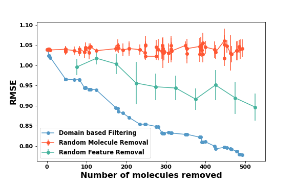

# doa
doa is a tool to find domains of applicability of machine learning models. These domains are expressed using the features that the model uses to represent the input data.

The details of the method can be found in our manuscript titled <b>Outlier-Based Domain of Applicability Identification for Materials Property Prediction Models</b> at https://doi.org/10.26434/chemrxiv-2023-pmrfw-v2.


|:--:|
| <b>How the test predictions improve as we remove data corresponding to 'difficult' domains identified by our method.</b>|


# 1. Installation

Cretae a conda environment,
```
conda env create -f environment.yml
```

Go to the doa directory where setup.py is located and type,


```
pip install .
```

# 2. Obtaining results
A complete example is given in the tutorials/1.getting_started.ipynb

---
This material was prepared as an account of work sponsored by an agency of the United States Government.  Neither the United States Government nor the United States Department of Energy, nor Battelle, nor any of their employees, nor any jurisdiction or organization that has cooperated in the development of these materials, makes any warranty, express or implied, or assumes any legal liability or responsibility for the accuracy, completeness, or usefulness or any information, apparatus, product, software, or process disclosed, or represents that its use would not infringe privately owned rights.

Reference herein to any specific commercial product, process, or service by trade name, trademark, manufacturer, or otherwise does not necessarily constitute or imply its endorsement, recommendation, or favoring by the United States Government or any agency thereof, or Battelle Memorial Institute. The views and opinions of authors expressed herein do not necessarily state or reflect those of the United States Government or any agency thereof.

<br/>
<center> PACIFIC NORTHWEST NATIONAL LABORATORY </center>
<center> operated by </center>
<center> BATTELLE </center>
<center> for the </center>
<center> UNITED STATES DEPARTMENT OF ENERGY </center>
<center> under Contract DE-AC05-76RL01830 </center>
